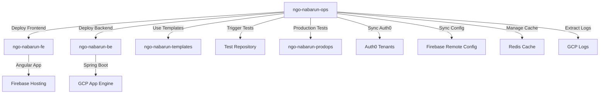

# NGO Nabarun Operations Repository

[](https://github.com/features/actions)
[](https://firebase.google.com/)
[](https://cloud.google.com/)
[](https://auth0.com/)

Central operations repository for NGO Nabarun's deployment orchestration, testing automation, and environment synchronization across multiple services and environments.

## 🏗️ Architecture Overview

This repository serves as the **central orchestration hub** that coordinates deployments across multiple repositories and services:



### Repository Structure

```
ngo-nabarun-ops/
├── .github/
│   └── workflows/           # GitHub Actions workflows
│       ├── deploy.yml       # Main deployment orchestration
│       ├── test.yml         # Automated testing
│       ├── sync-import-data.yml  # Data synchronization
│       ├── GCP-Logs.yml     # Log extraction utility
│       └── cache.yml        # Redis cache management
├── scripts/                 # Helper bash scripts
│   ├── set_run_name_deploy.sh   # Dynamic deploy naming
│   └── set_run_name_sync.sh     # Dynamic sync naming
├── docs/                    # Documentation
└── README.md               # This file
```

## 🚀 Quick Start

### Prerequisites

- Access to the NGO Nabarun GitHub organization
- Appropriate permissions for the environments you want to deploy to
- GitHub CLI (`gh`) installed for command-line operations

### Basic Deployment

**Deploy to Staging:**
```bash
# Via GitHub Actions UI
# 1. Navigate to Actions tab
# 2. Select "[Deploy] Deploy, Sync and Test Applications"
# 3. Click "Run workflow"
# 4. Fill in parameters and run

# Via GitHub CLI
gh workflow run deploy.yml \
  --repo nabarun-ngo/ngo-nabarun-ops \
  -f fe_deploy=true \
  -f fe_tag_name=v1.2.0 \
  -f be_deploy=true \
  -f be_tag_name=v1.1.5 \
  -f target_env=stage \
  -f run_smoke_test=true
```

**Deploy to Production:**
```bash
gh workflow run deploy.yml \
  --repo nabarun-ngo/ngo-nabarun-ops \
  -f fe_deploy=true \
  -f fe_tag_name=v1.2.0 \
  -f be_deploy=true \
  -f be_tag_name=v1.1.5 \
  -f target_env=prod \
  -f auth0_sync=true \
  -f run_smoke_test=true
```

## 🎯 Key Features

### 🔄 Multi-Service Orchestration
- **Independent Versioning**: Deploy frontend and backend independently with different versions
- **Conditional Deployment**: Choose to deploy only frontend, only backend, or both
- **Cross-Repository Coordination**: Automatically triggers workflows in other repositories

### 🧪 Automated Testing Integration
- **Smoke Tests**: Quick validation after deployments
- **Regression Tests**: Comprehensive testing on schedule
- **Parallel Execution**: Tests run in parallel for faster feedback
- **QMetry Integration**: Test results automatically uploaded to test management system

### 🔄 Environment Synchronization
- **Auth0 Tenant Sync**: Keep authentication configurations consistent across environments
- **Firebase Config Sync**: Synchronize remote configuration between environments
- **Environment-Specific Logic**: Automatic configuration based on target environment

### 🛠️ Operational Tools
- **GCP Log Extraction**: Download and format application logs by UUID
- **Redis Cache Management**: View, delete, and test Redis cache operations
- **Dynamic Workflow Names**: Meaningful workflow run names with version information

## 📋 Workflows Overview

### 🚀 Deploy Workflow (`deploy.yml`)
**Purpose**: Orchestrates deployment of Angular frontend to Firebase and Spring Boot backend to GCP App Engine.

**Triggers**:
- `workflow_dispatch` (Manual)
- `repository_dispatch` (API/Automated)

**Key Parameters**:
- `fe_deploy`, `fe_tag_name`: Frontend deployment settings
- `be_deploy`, `be_tag_name`: Backend deployment settings
- `target_env`: Target environment (stage/prod)
- `auth0_sync`: Enable Auth0 synchronization
- `run_smoke_test`: Run smoke tests after deployment

### 🧪 Test Workflow (`test.yml`)
**Purpose**: Manages automated smoke and regression testing.

**Triggers**:
- `workflow_dispatch` (Manual)
- `repository_dispatch` (From other workflows)
- `schedule` (Weekly regression tests)

**Test Types**:
- **Smoke Tests**: Quick validation (@smoke, @smokeprod tags)
- **Regression Tests**: Comprehensive testing (@regression tag)

### 🔄 Sync Workflow (`sync-import-data.yml`)
**Purpose**: Synchronizes Auth0 tenants and Firebase remote configurations.

**Capabilities**:
- Auth0 tenant synchronization between DEV/STAGE/PROD
- Firebase remote config synchronization
- Currently has sync workflows commented out (legacy)

### 🛠️ Utility Workflows
- **GCP-Logs.yml**: Extract application logs by UUID
- **cache.yml**: Redis cache management operations

## 🔧 Configuration

### Required Secrets

```bash
# Authentication
PAT                              # Personal Access Token for cross-repo access
GITHUB_TOKEN                     # GitHub token for API access

# Firebase Integration  
FB_SA_KEY                        # Firebase service account key
FB_SA_KEY_STAGE                  # Staging Firebase service account
FB_SA_KEY_PROD                   # Production Firebase service account
FB_SA_KEY_DEV                    # Development Firebase service account

# GCP Integration
GCP_SA_KEY                       # GCP service account key

# Auth0 Integration (Legacy)
AUTH0_CONFIG_STAGE               # Auth0 staging tenant configuration
AUTH0_CONFIG_DEV                 # Auth0 development tenant configuration

# Testing Integration
DOPPLER_TOKEN_NABARUN_BACKEND    # Backend configuration via Doppler
DOPPLER_TOKEN_NABARUN_TESTS      # Test configuration via Doppler
QMETRY_APIKEY                    # QMetry test management API key
QMETRY_OPEN_APIKEY               # QMetry open API key

# Cache Management
REDIS_HOST                       # Redis server host
REDIS_PORT                       # Redis server port
REDIS_PASSWORD                   # Redis authentication password
```

### Required Variables

```bash
# Project Configuration
FB_PROJECT_ID                    # Main Firebase project ID
FB_PROJECT_ID_STAGE              # Staging Firebase project ID  
FB_PROJECT_ID_PROD               # Production Firebase project ID
FB_PROJECT_ID_DEV                # Development Firebase project ID
GCP_PROJECT_ID                   # Google Cloud project ID
GCP_LOG_LEVEL                    # Logging level for deployments
```

## 📖 Usage Examples

### Frontend-Only Deployment
```bash
gh workflow run deploy.yml \
  --repo nabarun-ngo/ngo-nabarun-ops \
  -f fe_deploy=true \
  -f fe_tag_name=v2.1.0 \
  -f be_deploy=false \
  -f target_env=stage
```

### Backend-Only Deployment
```bash
gh workflow run deploy.yml \
  --repo nabarun-ngo/ngo-nabarun-ops \
  -f fe_deploy=false \
  -f be_deploy=true \
  -f be_tag_name=v1.8.2 \
  -f target_env=prod
```

### Production Deployment with Full Sync
```bash
gh workflow run deploy.yml \
  --repo nabarun-ngo/ngo-nabarun-ops \
  -f fe_deploy=true \
  -f fe_tag_name=v2.1.0 \
  -f be_deploy=true \
  -f be_tag_name=v1.8.2 \
  -f target_env=prod \
  -f auth0_sync=true \
  -f run_smoke_test=true
```

### Run Smoke Tests
```bash
gh workflow run test.yml \
  --repo nabarun-ngo/ngo-nabarun-ops \
  -f test_env=stage \
  -f test_type=Smoke \
  -f test_filter_tag_smoke='@smoke'
```

### Repository Dispatch API
```bash
# Trigger deployment via API
curl -X POST \
  -H "Authorization: token $GITHUB_TOKEN" \
  -H "Accept: application/vnd.github.v3+json" \
  https://api.github.com/repos/nabarun-ngo/ngo-nabarun-ops/dispatches \
  -d '{
    "event_type": "Trigger-Deploy-Sync-Test",
    "client_payload": {
      "fe_deploy": true,
      "fe_tag_name": "v2.1.0",
      "be_deploy": true,
      "be_tag_name": "v1.8.2",
      "target_env": "stage",
      "run_smoke_test": true
    }
  }'
```

## 🔍 Monitoring and Debugging

### Workflow Run Names
The repository uses dynamic workflow naming to provide context:
- Deploy: `"#PR Deploying to stage — FE:v1.2.0 BE:v1.1.5"`
- Sync: `"Syncing Auth0 tenant from 'STAGE' to 'PROD'"`

### Log Extraction
```bash
# Download logs for specific UUID
gh workflow run GCP-Logs.yml \
  --repo nabarun-ngo/ngo-nabarun-ops \
  -f uuid='your-request-uuid' \
  -f environment=stage \
  -f output_type=html
```

### Cache Management
```bash
# View Redis keys
gh workflow run cache.yml \
  --repo nabarun-ngo/ngo-nabarun-ops \
  -f action=view

# Test Redis connectivity
gh workflow run cache.yml \
  --repo nabarun-ngo/ngo-nabarun-ops \
  -f action=ping
```

## 🤝 Contributing

1. **Review Documentation**: Read all documentation in the `docs/` directory
2. **Follow Patterns**: Maintain the established orchestration patterns
3. **Test Changes**: Always test workflow changes in staging first
4. **Update Documentation**: Keep documentation current with any changes

## 📚 Documentation

- [Workflow Reference](docs/workflows.md) - Detailed workflow documentation
- [Setup Guide](docs/setup.md) - Complete setup and configuration guide
- [API Reference](docs/api.md) - Repository dispatch events and payloads
- [Troubleshooting](docs/troubleshooting.md) - Common issues and solutions
- [Development Guide](docs/development.md) - Guide for contributors

## 🆘 Support

For issues and questions:
1. Check the [Troubleshooting Guide](docs/troubleshooting.md)
2. Review workflow run logs in the Actions tab
3. Contact the development team through appropriate channels

---

**Note**: This repository orchestrates deployments across multiple services. Always verify the impact of deployments in staging before proceeding to production.
