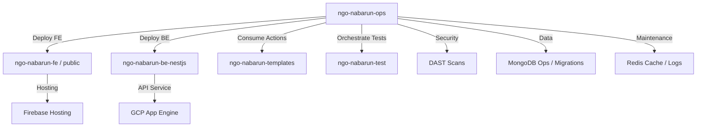

# 🚀 NGO Nabarun Operations Hub

[](https://github.com/features/actions)
[](https://firebase.google.com/)
[](https://cloud.google.com/)
[](https://owasp.org/www-project-zap/)

Central operations repository for NGO Nabarun's deployment orchestration, testing automation, and environment synchronization across multiple services and environments.

---

## 🏗️ Architecture Overview

This repository serves as the **central orchestration hub** that coordinates deployments across multiple repositories and services, heavily leveraging reusable templates from `ngo-nabarun-templates`.


```mermaid
graph TD
    A[ngo-nabarun-ops] -->|Deploy FE| B[ngo-nabarun-fe / public]
    A -->|Deploy BE| C[ngo-nabarun-be-nestjs]
    A -->|Consume Actions| D[ngo-nabarun-templates]
    A -->|Orchestrate Tests| E[ngo-nabarun-test]
    
    B -->|Hosting| G[Firebase Hosting]
    C -->|API Service| H[GCP App Engine]
    
    A -->|Security| I[DAST Scans]
    A -->|Data| J[MongoDB Ops / Migrations]
    A -->|Maintenance| K[Redis Cache / Logs]
```

### 📂 Repository Structure

```
ngo-nabarun-ops/
├── .github/
│   └── workflows/           # Orchestration workflows
│       ├── deploy-fe.yml    # Frontend (Angular/NextJS) deployment
│       ├── deploy-be.yml    # Backend (NestJS) deployment
│       ├── test.yml         # Automated testing orchestration
│       ├── dast-scan.yml    # Security vulnerability scanning
│       ├── migrate.yml      # Database & system migrations
│       ├── mongo-data.yml   # MongoDB data operations
│       ├── sync-import-data.yml # Data & config synchronization
│       └── GCP-Logs.yml     # Operational log extraction
├── scripts/                 # Orchestration helper scripts
└── config/                  # Environment-specific configurations
```

---

## 🧩 Powered by Templates

This repository is powered by **[ngo-nabarun-templates](https://github.com/nabarun-ngo/ngo-nabarun-templates)**, which provides:
- **Reusable Actions**: Standardized steps for build, deploy, and testing.
- **Workflow Blueprints**: Consistent CI/CD patterns across the organization.
- **Security & Ops Scripts**: Shared logic for GCP management and security scans.

---

## 🛠️ Workflows Overview

### 🚀 Deployment Pipelines
- **[Deploy Frontend](.github/workflows/deploy-fe.yml)**: Handles deployment of both the Angular portal and the NextJS public site to Firebase.
- **[Deploy Backend](.github/workflows/deploy-be.yml)**: Orchestrates NestJS deployment to GCP App Engine with integrated Prisma migrations.

### 🧪 Quality & Security
- **[Test Orchestration](.github/workflows/test.yml)**: Manages smoke and regression testing cycles with QMetry integration.
- **[DAST Security Scan](.github/workflows/dast-scan.yml)**: Automated OWASP ZAP and Nuclei scans to identify security vulnerabilities.

### 🔄 Data & Environment Ops
- **[System Migrations](.github/workflows/migrate.yml)**: Specialized migrations for users, finance, and document records.
- **[MongoDB Operations](.github/workflows/mongo-data.yml)**: Tooling for cloud MongoDB data imports and migrations.
- **[Sync & Import](.github/workflows/sync-import-data.yml)**: Synchronizes Auth0 tenants and Firebase Remote Configs.

### 🧹 Maintenance & Monitoring
- **[GCP Log Extraction](.github/workflows/GCP-Logs.yml)**: Downloads application logs by UUID for debugging.
- **[Cache Management](.github/workflows/cache.yml)**: Redis connectivity testing and key management.

---

## 🚀 Quick Start (CLI)

**Deploy Backend to Stage:**
```bash
gh workflow run deploy-be.yml \
  --repo nabarun-ngo/ngo-nabarun-ops \
  -f be_deploy_v2=true \
  -f be_tag_name=v2.4.0 \
  -f target_env=stage
```

**Run DAST Scan:**
```bash
gh workflow run dast-scan.yml \
  --repo nabarun-ngo/ngo-nabarun-ops \
  -f target_url='https://stage.ngonabarun.org' \
  -f scan_type=baseline
```

---

## 🔧 Essential Configuration

The orchestration requires several organization-level secrets (managed via GitHub Actions Secrets):
- `PAT`: Personal Access Token for cross-repo triggers.
- `GCP_SA_KEY`: Google Cloud Service Account.
- `FB_SA_KEY`: Firebase Service Account.
- `DOPPLER_TOKEN_*`: For secure secret injection during build/deploy.

---

## 🤝 Contributing

1. Always test workflow changes in **staging** before production.
2. Ensure any new reusable logic is moved to `ngo-nabarun-templates`.
3. Keep the README updated with any new workflow additions.

---

<p align="center">
  <sub>Orchestrated with precision for NGO Nabarun</sub>
</p>
